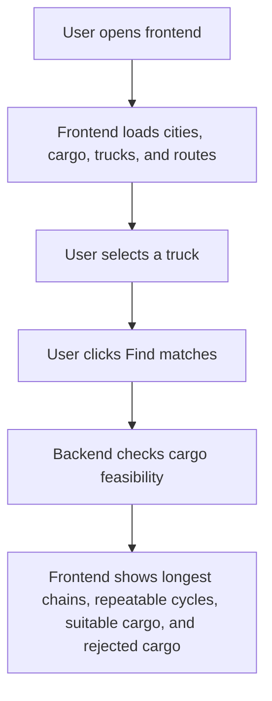

# Freight Matching System - Documentation

## 1. What This Project Is

This project is a small MVP prototype for freight matching in road transport.

The system helps check which cargo can be assigned to a selected truck. It does not solve a full logistics optimization problem. Instead, it demonstrates a simple and understandable feasibility check:

1. The user opens the web page.
2. The system shows cities, cargo, trucks, and a static route network.
3. The user selects one truck.
4. The user clicks `Find matches`.
5. The backend checks cargo feasibility and searches for continuous chains.
6. The frontend shows the longest chains, repeatable cargo cycles, suitable cargo, and rejected cargo with reasons.

The prototype is made for thesis demonstration purposes. It shows the core idea without implementing production-level logistics features.

## 2. Technology Stack

| Part | Technology | Purpose |
| --- | --- | --- |
| Frontend | React | User interface |
| Frontend tooling | Vite | Local development server and production build |
| UI icons | lucide-react | Interface icons |
| Backend | Node.js | JavaScript runtime |
| Backend framework | Express | REST API server |
| ORM | Prisma | Database schema and database access |
| Database | PostgreSQL | Stores cities, routes, cargo, and trucks |
| Testing | Vitest | Backend test runner |
| API testing | Supertest | Tests Express API endpoints |

## 3. Project Structure

```text
freight-matching-prototype/
│
├── backend/
│   ├── prisma/
│   │   ├── schema.prisma
│   │   └── seed.js
│   ├── src/
│   │   ├── app.js
│   │   ├── index.js
│   │   ├── prismaClient.js
│   │   ├── config/
│   │   │   └── time.js
│   │   ├── routes/
│   │   │   ├── cargo.js
│   │   │   ├── cities.js
│   │   │   ├── matches.js
│   │   │   ├── routes.js
│   │   │   └── trucks.js
│   │   └── services/
│   │       └── matchingService.js
│   └── tests/
│       └── api.test.js
│
├── frontend/
│   ├── src/
│   │   ├── App.jsx
│   │   ├── api.js
│   │   ├── main.jsx
│   │   ├── styles.css
│   │   ├── components/
│   │   │   ├── CargoList.jsx
│   │   │   ├── CityMap.jsx
│   │   │   ├── MatchResults.jsx
│   │   │   └── TruckList.jsx
│   │   ├── pages/
│   │   │   └── HomePage.jsx
│   │   └── utils/
│   │       └── date.js
│   └── vite.config.js
│
├── docs/
│   ├── project-documentation.md
│   └── testing-report.md
│
├── package.json
└── README.md
```

## 4. Backend

The backend is built with Node.js and Express.

Main backend files:

| File | Purpose |
| --- | --- |
| `backend/src/app.js` | Creates the Express application and connects API routes. |
| `backend/src/index.js` | Starts the backend server on a port. |
| `backend/src/prismaClient.js` | Creates the Prisma client used by routes and services. |
| `backend/src/config/time.js` | Stores the fixed calculation time used by the prototype. |
| `backend/src/services/matchingService.js` | Contains the freight matching logic. |
| `backend/prisma/schema.prisma` | Defines the database structure. |
| `backend/prisma/seed.js` | Fills the database with test data. |

The backend runs by default on:

```text
http://localhost:4000
```

## 5. Database

The database is PostgreSQL.

In the local workspace, the database files are stored in:

```text
F:\ThesisProject\.pgdata
```

This folder is local only and is ignored by Git.

The connection string is stored in `backend/.env.example`:

```text
DATABASE_URL="postgresql://postgres@localhost:5433/freight_matching?schema=public"
```

The database uses port:

```text
5433
```

### Main Tables

| Table | Purpose |
| --- | --- |
| `City` | Stores city names, country, and static map coordinates. |
| `CityRoute` | Stores static routes between cities, distance, and travel time. |
| `Cargo` | Stores cargo, pickup city, destination city, weight, time windows, and status. |
| `Truck` | Stores trucks, location or arrival city, capacity, movement state, and status. |

The project does not store calculated matches in a database table. Matches are calculated live by the API and returned directly to the frontend.

## 6. Seed Data

The seed script creates test data for the prototype.

Cities:

- Vaasa
- Seinäjoki
- Tampere
- Helsinki
- Turku
- Jyväskylä
- Oulu

Important routes:

- Vaasa to Seinäjoki
- Seinäjoki to Tampere
- Tampere to Helsinki
- Tampere to Turku
- Tampere to Jyväskylä
- Jyväskylä to Oulu
- Vaasa to Oulu

Routes are created in both directions.

Example cargo:

- Electronics pallets: Vaasa to Tampere
- Furniture shipment: Tampere to Helsinki
- Food delivery: Seinäjoki to Helsinki
- Heavy machinery parts: Turku to Tampere
- Northern medical supplies: Vaasa to Oulu
- Book cartons: Tampere to Helsinki
- Hospital supplies: Helsinki to Jyvaskyla
- Paper reels: Jyvaskyla to Oulu
- Return components: Oulu to Vaasa
- Spare parts: Turku to Vaasa

The extended seed data creates a demonstrable repeatable cargo cycle:

```text
Vaasa -> Tampere -> Helsinki -> Jyvaskyla -> Oulu -> Vaasa
```

Example trucks:

- Truck A: parked in Vaasa, available
- Truck B: moving to Tampere, available
- Truck C: parked in Turku, available
- Truck D: parked in Helsinki, unavailable

## 7. API Endpoints

| Endpoint | Method | Purpose |
| --- | --- | --- |
| `/api/health` | GET | Checks if backend is running and returns fixed calculation time. |
| `/api/cities` | GET | Returns all cities. |
| `/api/cities/:id/details` | GET | Returns one city with related routes, cargo, and parked trucks. |
| `/api/cargo` | GET | Returns all cargo. |
| `/api/cargo` | POST | Creates new cargo. |
| `/api/trucks` | GET | Returns all trucks. |
| `/api/trucks` | POST | Creates a new truck. |
| `/api/routes` | GET | Returns static city routes. |
| `/api/trucks/:id/matches` | GET | Calculates cargo matches for one truck. |

## 8. Matching Logic

Matching is implemented in:

```text
backend/src/services/matchingService.js
```

The matching logic checks:

1. Truck status.
2. Cargo status.
3. Truck capacity.
4. Truck effective city and effective time.
5. Travel time from truck location to pickup city.
6. Pickup time window.
7. Travel time from pickup city to destination city.
8. Delivery time window.

The system returns four result groups:

- `matches`: cargo that can be transported by the selected truck.
- `rejected`: cargo that failed one or more checks.
- `longestChains`: the longest continuous cargo chains found for the selected truck.
- `cycles`: continuous chains that return to the first pickup city, where the same first cargo can start the same sequence again.

Each result includes reasons, for example:

- `Cargo is ready for loading`
- `Truck capacity is sufficient`
- `Truck can reach pickup city before pickup window closes`
- `Truck can deliver cargo before delivery window closes`
- `Truck status is not available`
- `Cargo status is not ready_for_loading`

For a continuous chain, every next cargo must be picked up in the city where the previous cargo was delivered. The first cargo in a chain must be available in the truck's effective city. This demonstrates the main optimization idea of the prototype: reducing empty waiting by checking whether the truck can immediately take another suitable cargo at the arrival city.

A cycle is not defined as simply visiting the same city twice. A cycle is defined as a repeatable cargo sequence: the truck returns to the first pickup city, so the first cargo in the sequence can be taken again and the same pattern can continue.

The route check uses the static route network from the database. It can use multiple static route segments, but it is still a simple prototype check, not full vehicle routing optimization.

## 9. Frontend

The frontend is built with React and Vite.

Main frontend files:

| File | Purpose |
| --- | --- |
| `frontend/src/pages/HomePage.jsx` | Main page and user workflow. |
| `frontend/src/api.js` | API calls to the backend. |
| `frontend/src/components/CityMap.jsx` | Static city map and route visualization. |
| `frontend/src/components/TruckList.jsx` | Truck selection. |
| `frontend/src/components/CargoList.jsx` | Selected city cargo list with available-from and delivered-to sections. |
| `frontend/src/components/MatchResults.jsx` | Longest chains, repeatable cycles, suitable cargo, and rejected cargo results. |
| `frontend/src/utils/date.js` | Date and time formatting. |

The frontend runs by default on:

```text
http://127.0.0.1:5173
```

## 10. User Workflow



## 11. Fixed Calculation Time

The prototype uses a fixed calculation time so results are repeatable.

Configured value:

```text
2026-05-21T09:00:00+03:00
```

In UTC this is returned as:

```text
2026-05-21T06:00:00.000Z
```

The frontend displays it in local time for the user.

This makes testing and thesis reporting easier because matching results do not change depending on the real current time.

## 12. How To Run Locally

Install backend dependencies:

```bash
cd backend
npm install
```

Install frontend dependencies:

```bash
cd frontend
npm install
```

Start PostgreSQL from the project root:

```powershell
& 'C:\Program Files\PostgreSQL\18\bin\pg_ctl.exe' -D 'F:\ThesisProject\.pgdata' -l 'F:\ThesisProject\.pgdata\postgres.log' -o '"-p 5433"' start
```

Apply schema and seed data:

```bash
cd backend
npm run db:push
npm run db:seed
```

Start backend:

```bash
cd backend
npm run dev
```

Start frontend:

```bash
cd frontend
npm run dev
```

Open:

```text
http://127.0.0.1:5173
```

## 13. Testing

The project has automated tests for the MVP behavior.

Run all checks from the project root:

```bash
npm test
```

This command runs:

1. Backend seed reset.
2. Backend API tests.
3. Frontend production build.

The backend tests check:

- health endpoint
- fixed calculation time
- city list
- Vaasa to Oulu route
- city details with cargo
- Truck A matching logic, longest chain, and repeatable cycle detection
- Truck D rejection logic

More details are in:

```text
docs/testing-report.md
```

## 14. What Is Not Included

The project intentionally does not include:

- login
- real GPS
- live map
- payments
- contracts
- driver working hours
- machine learning
- real route calculation
- full vehicle routing optimization
- production deployment

These limitations keep the project focused on the thesis MVP: demonstrating the freight matching concept with a small working prototype.
